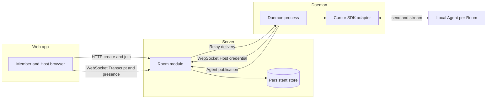
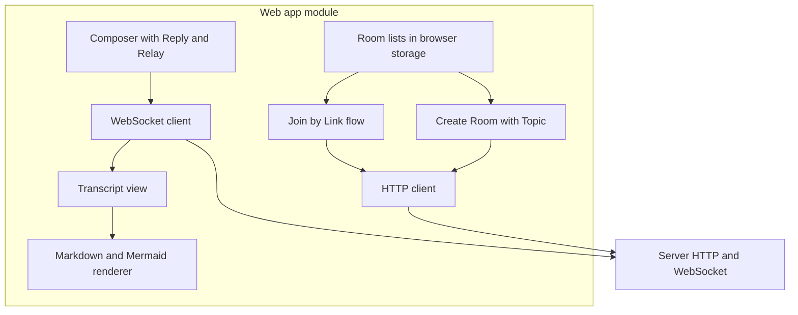
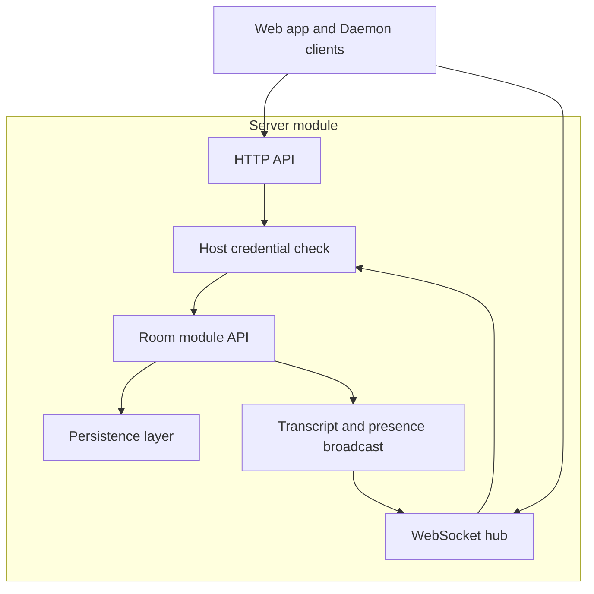
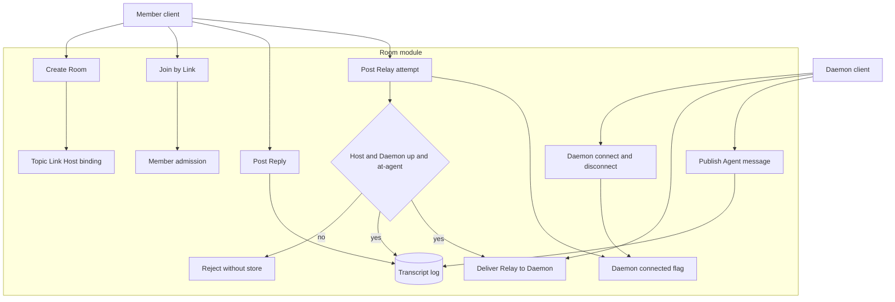
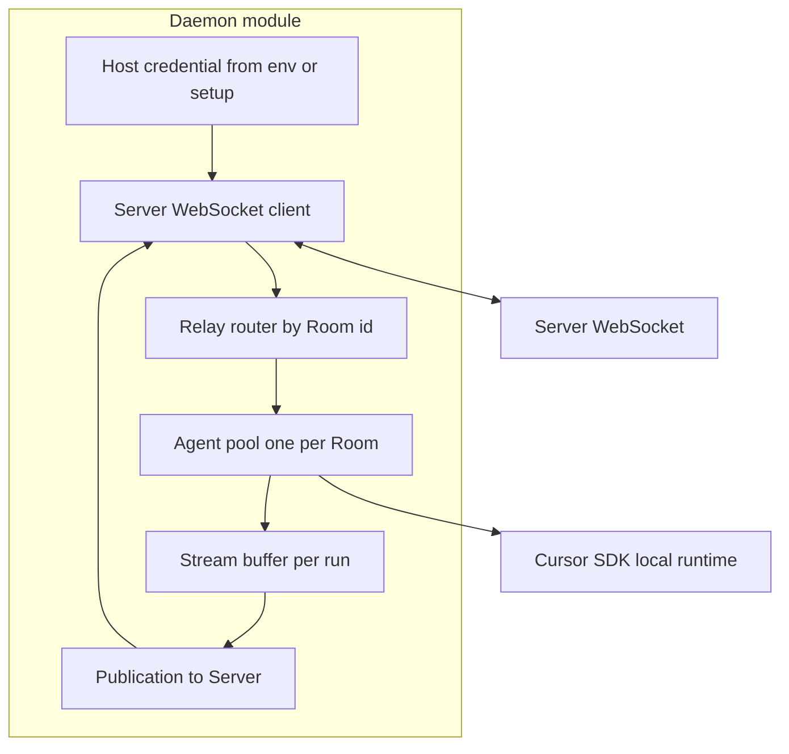
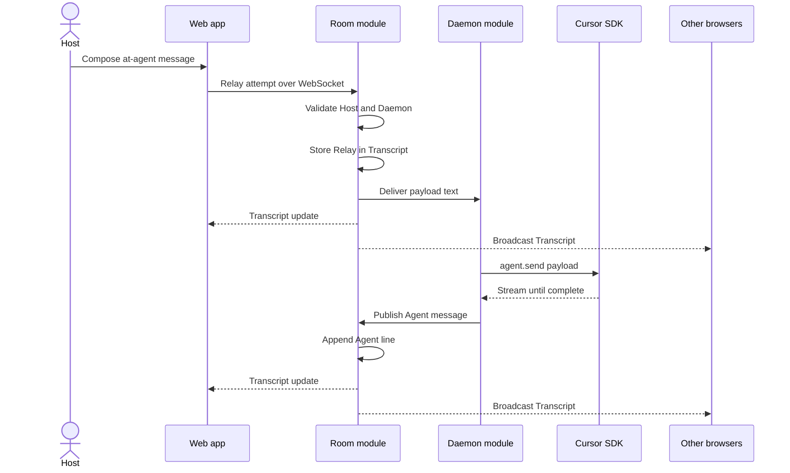

Status: ready-for-agent

# Hackathon POC: collaborative Room with Cursor Agent

## Problem Statement

Grill-with-docs work needs many roles in one place. Those roles are in different time zones. Each person can not run a separate grill and merge results in one day.

The Host uses Cursor on one machine. Other people must read the talk and add Replies. The Host must send work to the Agent from the Room. The Agent must answer in the Room. The Host must use Cursor-style text. The Host must use `@agent` and slash text. The team must ship a demo in one day.

## Solution

A Host creates a **Room** with a **Topic**. The Server stores the **Transcript**. The Server gives a **Link**. Members open the Link. Members post **Replies**. The Host posts Replies or **Relays**. A Relay contains `@agent`. The Host runs a **Daemon** on her machine. The Daemon connects with the **Host credential**. The Daemon holds one **Agent** per Room. The Daemon sends Relay text to the Agent. The Agent answer goes to the Transcript. The web app shows live updates on WebSocket. The web app renders markdown and Mermaid for all messages.

Members do not send Relays. The Host reads Replies and writes Relays when she chooses.

## Module diagrams

### System overview

All modules and data paths for the hackathon POC.

### Web app module

The browser client. It does not talk to the Daemon or the Agent.

### Server module

The long-lived process. It hosts HTTP, WebSocket, and persistence. Room rules live in the Room module.

### Room module

The test seam. All product rules for one Room sit here. Tests use a member client and a daemon client against this API only.

### Daemon module

Runs on the Host machine. One process can host many Rooms. Each Room gets one SDK Agent for the connection lifetime.

### Relay flow across modules

End-to-end path for one accepted Relay and one Agent answer.

## User Stories

1. As a Host, I want to create a Room with a Topic, so that the team has a named place to work.
2. As a Host, I want creation to make me the Host, so that only I can send Relays.
3. As a Host, I want the Server to mint an unguessable Link, so that I can share entry without accounts on day one.
4. As a Host, I want the Server to mint a Host credential for my browser, so that the Daemon can prove it is my machine.
5. As a Host, I want created Rooms in my browser list, so that I can return without the Link.
6. As a Member, I want to open the Link without Trimble ID on day one, so that I can join fast.
7. As a Member, I want to set a display name in my browser, so that Replies show a speaker name.
8. As a Member, I want a display name to be a label only, so that the name does not grant Host power.
9. As a Member, I want a bad Link to show no room data, so that Rooms stay private.
10. As a Member, I want to read the Transcript in order, so that I see Replies, Relays, and Agent messages.
11. As a Member, I want to post Replies at any time, so that talk continues when the Daemon is disconnected.
12. As a Host, I want to post Replies like a Member, so that I can talk without sending to the Agent.
13. As a Member, I want Replies to stay off the Agent path, so that the Agent does not see side talk alone.
14. As a Host, I want to send a Relay with `@agent` and a body, so that I can talk to Cursor like on my machine.
15. As a Host, I want to put slash text in a Relay, so that I can invoke skills such as `/grill` in the prompt.
16. As a Host, I want the Daemon to forward Relay body text to the Agent, so that the Server does not parse slash commands.
17. As a Host, I want one Agent conversation per Room, so that follow-up Relays keep context.
18. As a Host, I want Relays rejected when the Daemon is disconnected, so that I know the Agent did not get the text.
19. As a Host, I want a rejected Relay out of the Transcript, so that the log shows only accepted Agent traffic.
20. As a Host, I want a clear error when the Daemon is disconnected, so that I know why the Relay failed.
21. As a Member, I want `@agent` from me rejected and not stored, so that I can not drive the Agent.
22. As a Member, I want the Room to show Daemon connection state, so that I know if Relays can work.
23. As a Member, I want new Transcript lines without reload, so that the Room feels live.
24. As a Member, I want Agent answers as one final message per run, so that the UI stays simple on day one.
25. As a Member, I want Agent messages marked as the Agent, so that I can tell them from Host text.
26. As a Member, I want markdown on all Transcript lines, so that formatting is consistent.
27. As a Member, I want Mermaid in messages when present, so that diagrams render in the Room.
28. As a Host, I want multiline Relays in one Transcript entry, so that I can send long prompts.
29. As a Host, I want to run the Daemon with my Host credential, so that my machine binds to my Rooms.
30. As a Host, I want one Daemon to serve all Rooms I host, so that I do not run one process per Room.
31. As a Member, I want the Server to keep the Transcript after refresh, so that the demo survives reload.
32. As a developer, I want Room lists and visited Rooms in the browser on day one, so that we skip account systems.

## Implementation Decisions

- The Server is the system of record for each Room, the Transcript, Link, Topic, and Daemon presence. Browsers and the Daemon are clients.
- The product test seam is Room behavior on the Server. A member test client and a daemon test client are the two callers. The web UI and Cursor SDK sit behind those clients.
- Room creation requires a Topic. Creation binds the Host role to the creating browser and mints the Link and Host credential.
- Day-one identity is Link plus browser-local display name. Trimble ID is not required for the hackathon demo. The Host role stays separate from display name so TID can bind later.
- A Transcript entry has a kind: Reply, Relay, or Agent. Replies come from any Member without `@agent`. Relays come from the Host when the message contains `@agent` and the Server accepts it. Agent entries come from Daemon publication after a run completes.
- Relay acceptance needs Host role, `@agent` in the message, and a connected Daemon for that Room. The Server stores the Relay, then delivers payload text to the Daemon. Payload text is the message after the `@agent` marker, trimmed. The Server does not implement a slash command registry.
- There is no automatic primer message on day one. Each Relay is one user turn to the Agent. The Host can paste Reply text into a Relay when she wants the Agent to see it.
- While the Daemon is disconnected, Relays are rejected and not stored. Replies still append.
- The Daemon holds the Host credential, connects over WebSocket, receives Relay deliveries, and calls the Cursor SDK with one `Agent.create` per Room for the connection lifetime. Each Relay triggers `agent.send` with the payload text. The Daemon buffers stream output and publishes one Agent Transcript entry when the run finishes.
- The Daemon uses local SDK runtime with Host machine `cwd` and `CURSOR_API_KEY` in the environment.
- The web app uses WebSocket to the Server for Transcript updates and Daemon presence. REST or equivalent can create Rooms and join by Link.
- Persistence uses a durable store such as SQLite so Rooms survive process restart during the demo.
- Suggested monorepo shape: React web app, Node Server, Node Daemon package, pnpm workspaces.
- Build priority for the hackathon: complete Server Room plus WebSocket and tests, minimal chat UI with live Transcript, Daemon plus SDK Relays, then markdown and Mermaid rendering. Trimble ID is after those four.

## Testing Decisions

A good test calls Room behavior only through the member client and the daemon client. It checks stored Transcript order, Reply append, Relay accept and reject rules, and daemon delivery and publication. It does not check Cursor UI, SDK prompt wording, or web layout details.

The module under test is Room logic on the Server. The daemon client in tests records deliveries and can push Agent publications. The member client creates Rooms, joins by Link, posts Replies, and sends Relay attempts. There is no prior test suite. Tests should cover:

- Create binds Host, stores Topic, mints Link, and does not add Agent lines.
- Join by Link admits a Member. An invalid Link does not leak data.
- Replies append while the Daemon is disconnected and are not delivered to the Daemon.
- Non-Host Relay attempts are rejected and leave the Transcript unchanged.
- Relay while Daemon disconnected is rejected, leaves the Transcript unchanged, and returns a disconnected error.
- Accepted Relay is stored, delivered once to the Daemon with trimmed payload, and Agent publication appends one Agent line.
- Relay for one Room is not delivered to another Room Agent path.
- A caller without the Host credential can not publish Agent lines or receive Relay delivery.

## Out of Scope

- Trimble ID sign-in and token exchange for the hackathon demo.
- Draft, Glossary, ADR, Handoff, and Round document types from the full collaborative grilling spec.
- Automatic primer messages and grill-with-docs-only Agent mode.
- Relay queue while the Daemon sleeps.
- Host transfer, Link revoke, and member `@agent` stored as Reply.
- Streaming partial Agent text into the Transcript.
- Storing the Cursor thread on the Server.
- Issue tracker publish from inside the Room.
- In-memory-only persistence for the demo.

## Further Notes

This spec scopes the one-day hackathon MVP. The long-form spec in the repo remains the north star for the full product. Vocabulary matches `CONTEXT.md`. After the demo, TID, structured grill documents, and primer logic can return from the full spec.
