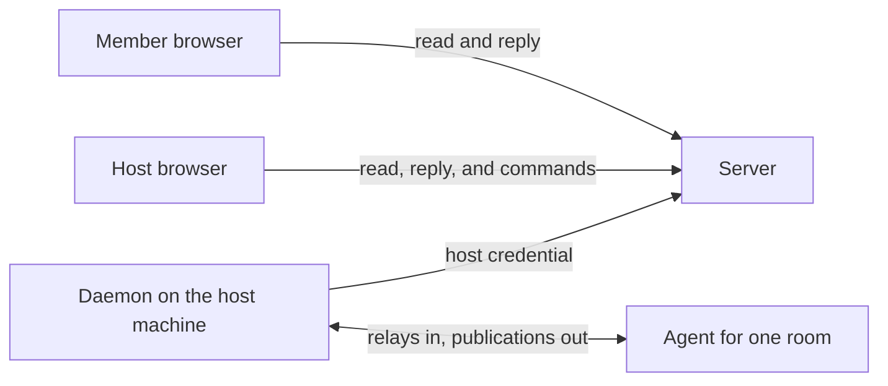
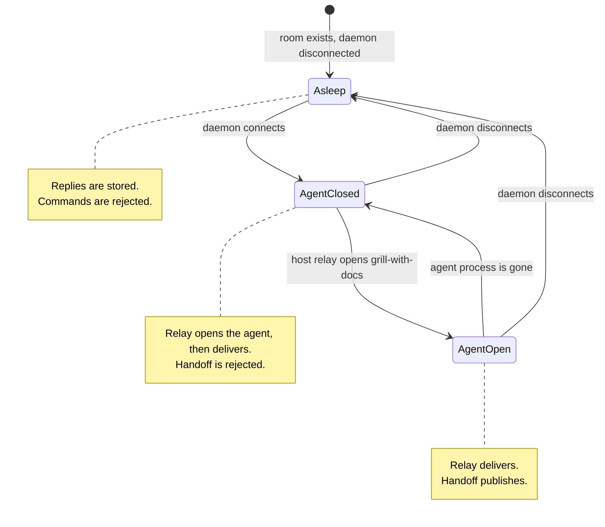
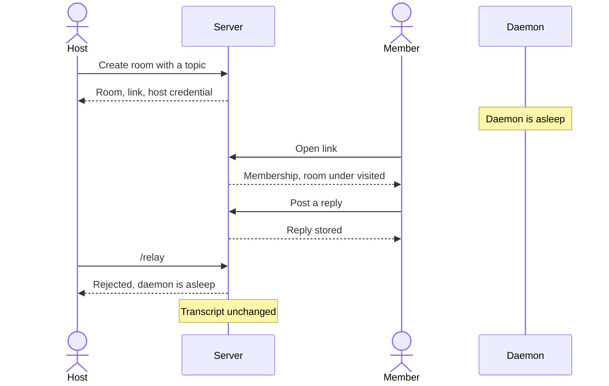
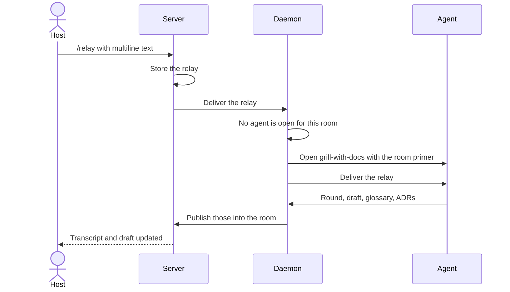
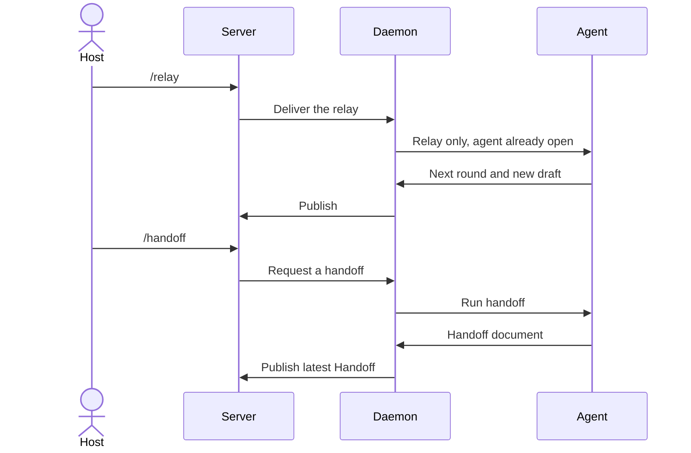

Status: ready-for-agent

# Collaborative grilling

## Problem Statement

Grilling a feature with grill-with-docs is a solitary activity. A real feature needs a product owner, a subject-matter expert, an architect, lead developers, and a project manager, and those people are spread across timezones. Today each person would have to run their own grill and reconcile the results later, which rarely happens.

The host's Cursor agent is also tied to one machine. When that machine is asleep, the others can still need to talk, and the record of the grill has to be there in the morning. The agent must not invent a shared understanding from discussion it was never shown. The host decides what the agent reads.

## Solution

A **Room** is a shared place for exactly one **Grill**. The **Server** stores every room for its whole life: the **Transcript**, the **Draft**, the **Glossary**, the **ADRs**, and the latest **Handoff**. Members join with a **Link** and post **Replies**. Those replies stay on the server and are never sent to the agent on their own.

The **Host** runs a **Daemon** on their machine. The daemon connects to the server with the host credential and is the only path between the room and that room's **Agent**. The host types `/relay` in the room to send a **Relay**, and `/handoff` to request a Handoff. While the daemon is asleep, the room stays readable and replies continue. Commands are rejected and are not stored.

The first relay after the daemon is connected, if that room's agent is closed, opens the agent on grill-with-docs. The daemon primes it from the room, then delivers the relay. Later relays only deliver. The agent publishes rounds, the draft, glossary updates, ADRs, and handoffs back through the daemon into the room.

### Flow: a room begins while the daemon is asleep

### Flow: the first relay opens the agent

### Flow: a later relay, and a handoff

## User Stories

1. As a host, I want to create a room from my list of rooms by giving it a topic, so that a grill exists for that topic.
2. As a host, I want creating a room to make me the host, so that I am the only person who can relay to its agent.
3. As a host, I want the server to mint an unguessable link when the room is created, so that I can share entry without creating accounts.
4. As a host, I want the new room to appear under rooms I created, so that I can return to it from this browser.
5. As a host, I want to create a room while my daemon is asleep, so that I can share the link before my machine is ready.
6. As a host, I want a room to be created already holding its one grill, so that I do not have a separate step to start the grill.
7. As a host, I want the agent to stay closed when the room is created, so that a grill does not start just because the room exists.
8. As a host, I want the agent to stay closed when the daemon connects, so that connecting my machine does not by itself ask the first round.
9. As a member, I want to open a room link without signing in, so that I can join as quickly as opening a shared drawing.
10. As a member, I want opening the link to make me a member, so that I can read and reply.
11. As a member, I want the room to appear under rooms I have visited, so that I can return without the link.
12. As a member, I want to choose a display name stored in this browser, so that replies show who spoke.
13. As a member, I want my display name to be only a label, so that using someone else's name does not make me the host.
14. As a stranger, I want an unknown room address to reveal nothing, so that rooms stay private to people with the link.
15. As a host, I want to revoke the link, so that new people can no longer join.
16. As an existing member, I want revoking the link to leave me in the room, so that I do not lose the transcript.
17. As a member, I want to read the transcript, so that I can see replies, relays, and rounds in order.
18. As a member, I want to open the draft with one click, so that I can read what has transpired without scrolling the transcript.
19. As a member, I want the draft to show the problem, the settled decisions, and the open frontier as of the last published round, so that I know the state of the grill.
20. As a member, I want to read the glossary, so that I can use the same words as the grill.
21. As a member, I want to read each ADR, so that I can see why a hard decision was made.
22. As a member, I want to read the latest handoff when one exists, so that I can see the compact the next agent would see.
23. As a member, I want to read all of those while the daemon is asleep, so that timezones do not hide the record.
24. As a member, I want a reply I post to be stored immediately, so that the host can read it later.
25. As a member, I want to post replies while the daemon is asleep, so that overnight discussion is not blocked.
26. As a host, I want to post replies the same way a member does, so that I can talk in the room without the agent treating my words as a turn.
27. As a member, I want my reply to stay out of the agent, so that discussion is not silently treated as a decision.
28. As a member, I want a reply alone not to change the draft, so that the draft moves only when the agent publishes.
29. As a member, I want a reply alone not to reopen a finished frontier, so that the host remains the person who talks to the agent.
30. As a member with the room open, I want new replies, relays, rounds, and document updates to appear without reloading, so that a live group sees one transcript.
31. As a host, I want `/relay` plus a multiline message to be stored in the transcript, so that members can see exactly what I sent the agent.
32. As a host, I want that relay delivered to this room's agent when the daemon is connected and the agent is already open, so that the grill continues.
33. As a host, I want the first `/relay` while the daemon is connected and the agent is closed to open the agent, so that I do not have a separate start command.
34. As a host, I want that newly opened agent to run grill-with-docs, so that the interview matches the skill we already use.
35. As a host, I want the new agent primed from the topic, the draft, the glossary, the ADRs, and every relay already in the transcript, so that a fresh Cursor thread can continue this grill.
36. As a host, I want replies left out of that primer, so that the agent learns a reply only when I put it in a relay.
37. As a host, I want the relay that opened the agent to be delivered after the primer, so that my latest message is the user turn.
38. As a host, I want a later `/relay` to deliver only that message, so that the agent is not primed a second time.
39. As a host, I want to omit or rephrase replies inside a relay, so that I decide what the agent reads.
40. As a member, I want to see a relay that omitted my reply, so that I can tell what was left out.
41. As a host, I want a relay to be accepted even when the frontier is empty, so that I can correct this grill by relaying a message.
42. As a host, I want the agent to be able to put a decision back on the frontier after such a relay, so that a correction becomes a new round and a new draft.
43. As a host, I want `/relay` rejected when the daemon is asleep, so that I am told nothing was sent.
44. As a host, I want a rejected relay not to appear in the transcript, so that the record contains only messages the agent could receive.
45. As a host, I want the error to say the daemon is asleep, so that I know why the command failed.
46. As a member, I want `/relay` and `/handoff` from me to be rejected and not stored, so that I cannot talk to the agent or publish a handoff.
47. As a host, I want `/handoff` to publish a handoff into the room when the agent is open and the daemon is connected, so that members and a future agent can read the compact.
48. As a host, I want the handoff to reference the glossary, the draft, and the ADRs, so that it does not copy documents that already live in the room.
49. As a host, I want `/handoff` rejected while the agent is closed, so that a handoff is not attempted before grill-with-docs is open.
50. As a host, I want `/handoff` rejected while the daemon is asleep, so that no command reaches a disconnected machine.
51. As a member, I want the room to show whether the daemon is asleep or connected, so that I know commands cannot reach the agent.
52. As a host, I want one daemon on my machine to serve every room I host, so that I do not run a process per room.
53. As a host, I want each room to have its own agent, so that two grills do not share one Cursor thread.
54. As a host, I want a relay in one room delivered only to that room's agent, so that rooms stay isolated.
55. As a host, I want the daemon to connect with the same host credential as the browser that created the room, so that a member's browser cannot publish rounds or receive relays.
56. As a host, I want rounds the agent produces to appear in the transcript without me retyping them, so that other timezones can read the questions.
57. As a member, I want the draft replaced by the agent's new draft whenever a round is published, so that the clickable PRD stays current.
58. As a member, I want glossary updates published with the agent's work, so that I always read the current language.
59. As a member, I want each ADR the agent writes published into the room, so that the decision is not stuck on the host's machine.
60. As a host, I want the agent to settle only the frontier questions my relay addresses, so that the room follows grill-with-docs rather than a quorum of roles.
61. As a host, I want a second topic to require a new room, so that one room never holds two grills.
62. As a member, I want a finished room to stay readable, so that the record of a completed grill remains available.
63. As a member, I want to keep posting replies in a finished room, so that discussion can continue after the frontier is empty.
64. As a host, I want my created-room list and my visited-room list kept in this browser, so that version 1 needs no account.
65. As a host, I want losing this browser to mean I can no longer relay, so that the host credential is not a guessable display name.
66. As a member, I want the server to keep the transcript and the documents after the host's machine is gone, so that the conversation is not lost with the Cursor thread.

## Implementation Decisions

- The server is the system of record for every room. Browsers and daemons are clients. The server is not only a signaler. A Cursor thread is not stored. Reopening an agent primes grill-with-docs from the server's record.
- There is one product seam: the room's external behavior. A member client and a daemon client are the two callers. Cursor and the browser UI sit behind those callers.
- A room is created with a required topic and exactly one grill. Creation mints the link and binds the host credential to the creating browser. There is no `/grill` command.
- Membership is opening the link. Version 1 has no sign-in. The display name is browser-local and is not an authorization. The host credential, held by the creating browser and presented by the daemon, is what may relay and what may publish.
- The daemon holds that host credential, serves every room bound to it, and speaks to one agent conversation per room. Publications move daemon to server: rounds into the transcript, plus the draft, glossary, ADRs, and the latest handoff. Relays move server to daemon to agent.
- Command results are an explicit set. A non-host command is rejected and not stored. While the daemon is asleep, every command is rejected and not stored, and the error states that the daemon is asleep. There is no command queue in this version. `/handoff` is also rejected while the agent for that room is closed. `/relay` while the daemon is connected and the agent is closed opens grill-with-docs, applies the primer, then delivers that relay. `/relay` while the agent is open delivers only the new relay.
- The primer contains the topic, the current draft, the glossary, the ADRs, and the relays already in the transcript, in transcript order. It omits replies. The opening relay is not part of the primer. It is the first user turn after the primer.
- The agent runs grill-with-docs. That skill produces the interview, the glossary, and ADRs. The draft is an additional room document: the problem, the settled decisions, and the open frontier. The agent publishes a new draft whenever it publishes a round. Unread replies do not change it. A handoff references those documents and does not duplicate them.
- A relay is an ordinary transcript message once accepted. Members can read it, including omissions. The transcript is one ordered log, not threads under questions.
- Connected clients learn of new transcript messages and new documents from the server. Reading never contacts the daemon.
- The room exposes whether the daemon is connected. The host sees command errors. A rejected command does not create a transcript message.
- Lists of created and visited rooms live in the browser next to the host credential. The server does not have user accounts in this version.
- A later Trimble ID sign-in will require every member to be a signed-in Trimble user, keep the link as the admission, and bind the host as the Trimble user who claims the creating browser. This version only has to keep the host as a role separate from the display name, so that claim is possible later.
- Transfer of the host is not implemented. `/handoff` must not change the host.

## Testing Decisions

A good test exercises the room through the member client and the daemon client. It asserts stored documents, transcript order, command acceptance, and what the daemon was asked to do. It does not assert Cursor's UI, prompt wording beyond the primer's contents, or how the browser is laid out.

The only module under test is the room. The daemon client in tests is a stand-in that records relays and can push publications. The member client in tests is a stand-in that creates rooms, joins by link, posts replies, and issues commands. There is no existing test suite to copy. Tests to cover:

- Create binds a host, stores the topic, and mints a link. No round is published.
- Join by link adds a member. A bad link does not. Revoke blocks new joins and keeps old members.
- Replies append while the daemon is asleep and are not offered to the daemon.
- A relay and a handoff from a non-host are rejected and leave the transcript unchanged.
- A relay and a handoff while the daemon is asleep are rejected, leave the transcript unchanged, and say the daemon is asleep.
- The first relay while the daemon is connected and the agent is closed stores the relay, asks the daemon to open grill-with-docs with the primer, then delivers that relay. The primer includes prior relays and excludes replies.
- A relay while the agent is open delivers only the new relay and does not send a second primer.
- A handoff while the agent is closed is rejected. A handoff while the agent is open asks the daemon to produce one, and the server stores it as the latest handoff.
- Publications from the daemon append rounds and replace the draft, glossary, and ADRs for that room only.
- A relay for one room is not delivered to another room's agent.
- A caller without the host credential cannot publish and cannot receive relays.

## Out of Scope

- Transfer of the host, and any use of `/handoff` to change who the host is.
- Trimble ID sign-in, token exchange, and claiming existing rooms. Version 1 only keeps the host role separate from the display name.
- Queueing commands for delivery when the daemon wakes. A command during sleep is an error.
- A `/grill` command, more than one grill in a room, and reopening a grill as a second grill inside the same room.
- Letting a member attach their own Cursor agent.
- Storing the Cursor thread on the server.
- Accounts, email invites, and approval to join.
- Members editing the draft, the glossary, or an ADR.
- Editing or deleting a stored relay. A correction is a new relay.
- Running grill-with-docs somewhere other than the host's agent.
- Exporting the draft with `/to-spec` or any issue-tracker publish from inside a room.

